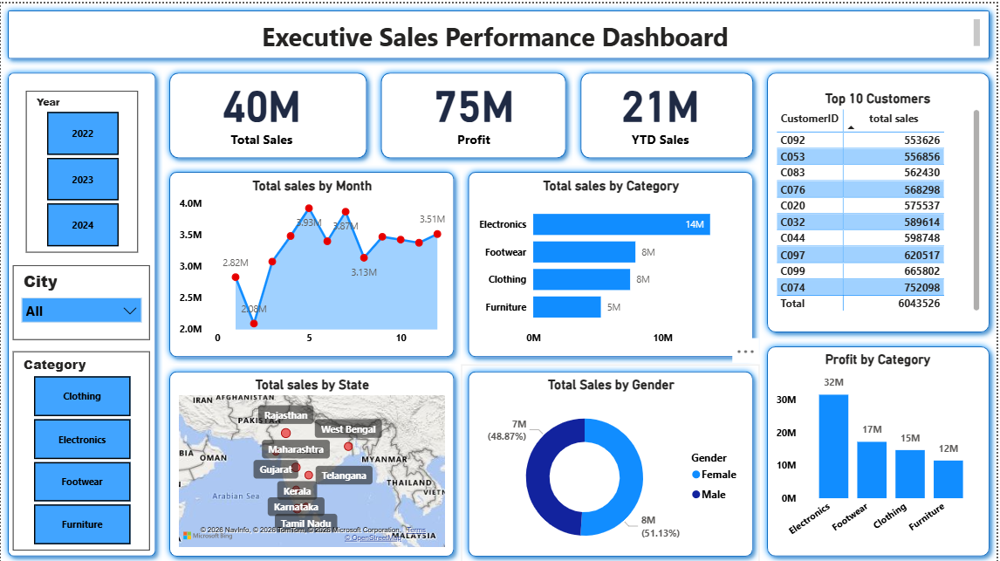

📊 Sales Performance Analytics Dashboard (Power BI)
📌 Project Overview

This project presents an interactive Power BI dashboard designed to analyze sales performance and business insights. The dashboard provides a clear and executive-level overview of sales metrics, helping businesses understand trends, profitability, and customer behavior.

The goal of this project is to transform raw sales data into actionable insights that support better decision-making.

🚀 Key Insights from the Dashboard

The dashboard highlights several important business metrics:

📈 Total Sales Performance: 40M

💰 Total Profit Analysis: 75M

📅 Year-to-Date Sales (YTD): 21M

📊 Monthly Sales Trends

🛍 Category-wise Sales Performance

🗺 State-wise Sales Distribution

👥 Customer Segmentation (Top 10 Customers)

⚥ Gender-based Sales Analysis

These insights allow stakeholders to quickly evaluate business performance and growth opportunities.

🧠 Business Questions Solved

This dashboard helps answer important business questions such as:

Which product categories generate the highest sales?

Which states contribute the most revenue?

Who are the top customers driving business growth?

How does monthly sales performance change over time?

What is the difference between male and female purchasing behavior?

How is the company performing year-to-date?

🛠 Tools & Technologies Used

Power BI

Power Query (Data Transformation)

DAX (Data Analysis Expressions)

Star Schema Data Modeling

Interactive Slicers & Filters

📊 Dashboard Features

✔ Clean executive-level dashboard layout
✔ Interactive slicers for dynamic analysis
✔ Business-driven KPIs for performance tracking
✔ Time Intelligence (YTD Analysis)
✔ Star Schema Data Model for efficient analysis
✔ Custom DAX measures for revenue, profit, and trends

📷 Dashboard Preview

(Add your dashboard screenshot here)

🎯 Project Objective

The primary objective of this project is to build a professional, decision-ready analytics dashboard that enables business leaders to:

Track performance

Identify sales trends

Analyze customer behavior

Make data-driven decisions

💡 Future Improvements

Add sales forecasting

Implement regional performance comparison

Build customer lifetime value analysis

Add advanced drill-through analytics

🤝 Feedback

I’m always open to feedback, suggestions, and collaboration opportunities.
If you found this project useful, feel free to ⭐ the repository.

📬 Connect With Me

Thanda Anil Kumar
📧 Email: thandaanil987@gmail.com

📊 Data Analyst | Power BI | SQL | Python | Excel
